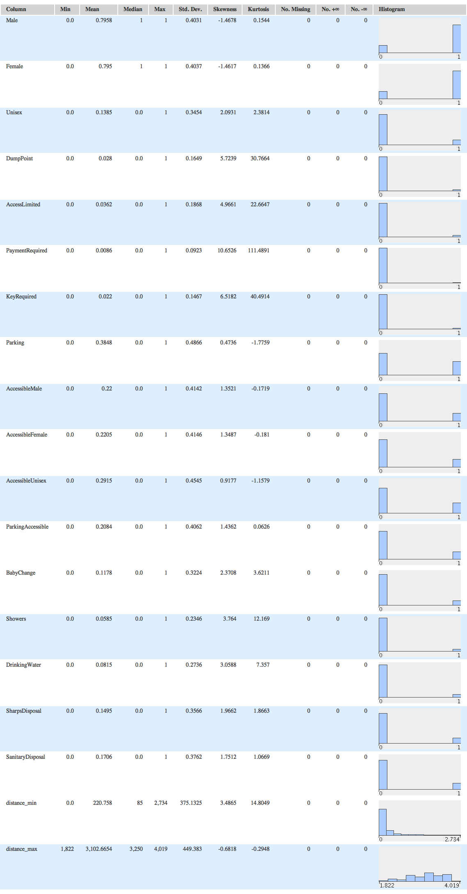
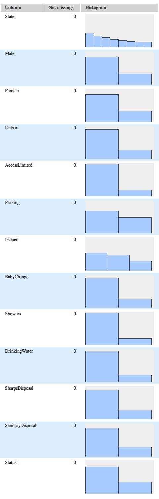
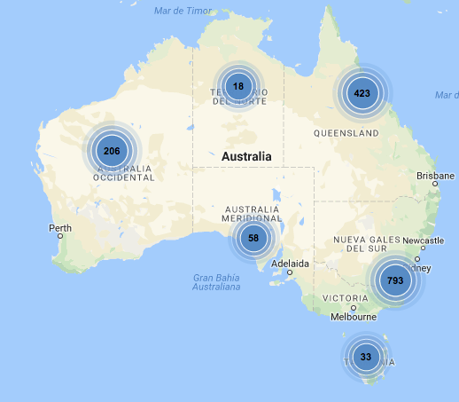

<!--
---
title: National Public Toilet Map
author: Ernesto Serrano Collado
header-includes:
    - \usepackage[utf8]{inputenc}
    - \usepackage{fancyhdr}
    - \pagestyle{fancy}
    - \DeclareUnicodeCharacter{}{o}
abstract: Análisis del conjunto de datos National Public Toilet Map que muestra la ubicación de más de 17.000 baños publicos en toda Australia.
keywords: toilet, map, datamining, KNIME, data analysis
---
-->

# Tratamiento Inteligente de Datos

## Introducción

El *Mapa nacional de baños públicos* muestra la ubicación de más de **17.000** baños públicos y privados en toda Australia. Los detalles de las instalaciones sanitarias también se pueden encontrar a lo largo de las principales rutas de viaje y también para viajes más cortos. Se proporciona información útil sobre cada baño, como la ubicación, el horario de apertura, la disponibilidad de habitaciones para bebés, la accesibilidad para personas con discapacidades y los detalles de otros baños cercanos.

Es un *dataset* curioso y perfecto para practicar minería de datos para la asignatura *Tratamiento Inteligente de Datos* del *Master Profesional en Ingeniería Informática*. El *dataset* se puede extraer libremente desde la web: https://data.gov.au/dataset/national-public-toilet-map y tiene licencia Creative Commons.

### *Dataset*

El *dataset* escogido contiene las estadísticas de los 17.000 baños públicos y privados en toda Australia. Las estadísticas cuentan entre otros con los siguientes datos:

1. toilet name.
2. address.
3. latitude and longitude.
4. general toilet features.
5. location.
6. accessibility.
7. opening hours.
8. additional features (e.g. showers, baby change facilities etc).
9. notes (e.g. coin operated showers etc).

Casi todos los datos son de tipo booleano, pasamos a continuación a mostrar la lista completa de los campos indicando los que hemos omitido así como los distintos tipos de datos que hemos extraido de ellos.

- ToiletID *(integer)*
- ~~URL~~ *(string)*
- ~~Name~~ *(string)*
- ~~Address1~~ *(string)*
- Town *(string)*
- State *(string)*
- Postcode *(integer)*
- ~~AddressNote~~ *(string)*
- Male *(boolean)*
- Female *(boolean)*
- Unisex *(boolean)*
- DumpPoint *(boolean)*
- ~~FacilityType~~ *(string)*
- ~~ToiletType~~  *(string)*
- AccessLimited *(boolean)*
- PaymentRequired *(boolean)*
- KeyRequired *(boolean)*
- ~~AccessNote~~ *(string)*
- Parking *(boolean)*
- ~~ParkingNote~~ *(string)*
- AccessibleMale *(boolean)*
- AccessibleFemale *(boolean)*
- AccessibleUnisex *(boolean)*
- AccessibleNote *(boolean)*
- ~~MLAK~~ *(boolean)* MLA Key (acceso con código)
- ParkingAccessible
- ~~AccessibleParkingNote~~ *(string)*
- ~~Ambulant~~ *(boolean)* (baño portail)
- ~~LHTransfer~~ *(boolean)*
- ~~RHTransfer~~ *(boolean)*
- ~~AdultChange~~ *(boolean)*
- IsOpen *(string)*
- ~~OpeningHoursSchedule~~ *(string)*
- ~~OpeningHoursNote~~ *(string)*
- BabyChange *(boolean)*
- Showers *(boolean)*
- DrinkingWater *(boolean)*
- SharpsDisposal *(boolean)* Eliminación segura de agujas
- SanitaryDisposal *(boolean)* Eliminación segura de productos sanitarios
- ~~IconURL~~ *(string)*
- ~~IconAltText~~ *(string)*
- ~~Notes~~ *(string)*
- Status *(string)*
- Latitude *(double)*
- Longitude *(double)*

### Datos adicionales

Para poder saber la proximidad de los baños publicos a los principales nucleos de població hemos tenido que hacer uso del problema del par de puntos mas cercanos así como extraer la lista de las principales ciudades de australia para calcular la distancia hacia estas.

El problema de los puntos mas cercanos lo vimos en el siguiente artículo:
 - https://en.wikipedia.org/wiki/Closest_pair_of_points_problem

La lista de las principales ciudades de australia la hemos extraido de los siguientes sitios:
 - https://en.wikipedia.org/wiki/List_of_cities_in_Australia_by_population
 - http://www.geonames.org/AU/largest-cities-in-australia.html

#### Población de australia (2016)


Para calcular la distancia de cada baño publico hacia las principales ciudades se ha utilizado la *fórmula del haversine o semiverseneo* que es una importante ecuación para la navegación astronómica, en cuanto al cálculo de la distancia de círculo máximo entre dos puntos de un globo sabiendo su longitud y su latitud.

> Mas información: https://en.wikipedia.org/wiki/Haversine_formula

La formula dice que para cualquier par de puntos sobre una esfera:


donde:

 - d es la distancia entre dos puntos (sobre un círculo máximo de la esfera, véase distancia esférica),
 - R es el radio de la esfera, en este caso 6371 que es el radio en kilómetros de la tierra,
 - phi1, phi2 latitud del punto 1 y latitud del punto 2 en radianes,
 - lambda1, lambda2 longitud del punto 1 y longitud del punto 2 en radianes.

Se ha aplicado esa fórmula utilizando una hoja de cálculo para poder aplicarlo a cada baño público cruzándolo con los datos de las principales ciudades

```
= ACOS(COS(RADIANS(90-Latitude_1))
- COS(RADIANS(90-Latitude_2))
+ SIN(RADIANS(90-Latitude1)) SIN(RADIANS(90-Latitude_2))
- COS(RADIANS(Longitude1-Longitude2))
* 6371
```

Una vez obtenidos estos datos adicionales se han agregado al dataset indicando tanto la mínima distancia como la máxima a cualquiera de las 10 principales ciudades de Australia con lo que tenemos las siguientes columnas adicionales:

- Sidney *(integer)*
- Melbourne *(integer)*
- Brisbane *(integer)*
- Perth *(integer)*
- Adelaide *(integer)*
- Gold Coast *(integer)*
- Canberra *(integer)*
- Newcastle *(integer)*
- Wollongong *(integer)*
- Logan City *(integer)*
- distance_min *(integer)*
- distance_max *(integer)*

### Objetivos

El objetivo principal es ver si hay mayor cantidad de urinarios públicos cerca de los nucleos urbanos, y si los servicios que ofrecen los mismos se ven incrementados por la proximidad.

## Minería de datos

Se ha decidido realizar el trabajo utilizando la herramienta KNIME debido a la sencillez de uso al ser una herramienta visual que hace muy sencillo el poder ir probando las distintas técnicas.

### Pre-procesamiento de datos

Antes de aplicar las técnicas aprendidas en la asignatura realizaremos un pre-procesado de los datos mediante técnicas de estadística descriptiva con el objetivo de conocer nuestro *dataset* para poder utilizar posteriormente las distintas técnicas.

Lo primero de todo hemos agregado un nodo *FileReader* que hemos configurado para leer nuestro dataset, en el mismo se han configurado los tipos de columna ya que por defecto *KNIME* lo lee todo automáticamente como cadenas y muchos de nuestros datos son de tipo booleano y de tipo numérico. Además se han omitido desde el propio *FileReader* algunas columnas que contenían textos que no nos resultan útiles para el procesamientos

Se ha agregado un nodo de estadísticas para ver una primera aproximación visual de los datos que tenemos.






Para comprobar las observaciones realizadas mediante los histogramas pasamos a realizar una correlación lineal entre las variables con el objetivo de encontrar que las variables observadas tienen cierta correlación con las distancias agregadas y además comprobar si hay algunas variables con una correlación muy alta lo que puede indicar que se derivan unas de otras y se pueden eliminar del dataset al aportar la misma información.


Como se puede apreciar existen muchas X en esta matriz lo que indica que no existe correlación entre las variables, esto se puede deber a que muchas variables son booleanas y es complicado realizar una correlación entre variables booleanas o entre una variable booleana y otra numérica.

Las correlaciones más importantes que se observan son:

 - Correlación entre Male y Female.
 - Correlación entre AccesibleMale y AccessibleFemale.
 - Correlación entre Status y IsOpen.
 - Correlación negativa entre Unisex y Male/Female, igualmente hay una correlación negativa entre AccesibleUnisex y AccesibleMale/AccessibleFemale.

Una vez corregidos los datos hemos visualizado los distintos puntos en el mapa para hacernos una idea de la localización de los mismos, los distintos baños publicos aparecen en gris, y las principales ciudades aparecen marcadas en rojo.


También hemos visto interesante diferenciar los baños públicos dependiendo del estado, como podemos ver en el siguiente mapa.


Se aprecia como Nueva Gales del Sur, que es donde está Sidney, es la que mayor cantidad de baños tiene con `10591`, y por otro lado los Territorios del Norte solo poseen `211`.

Otro dato curioso es la poca cantidad de baños que cuentan con un cambiador de ropa para adultos. Dato que contrasta con la gran cantidad de baños que cuentan con punto de eliminación segura de agujas, que además es mayor que la cantidad de baños que poseen agua potable.





##  Análisis descriptivo

### Clustering

El clustering necesita de una función de distancia y/o semejanza para extraer la matriz de proximidad, estas funciones trabajan muy bien con variables numéricas o incluso nominales ordinales, pero no tan bien con variables nominales no ordinales (Vila, 2014).
En cualquier caso teniendo en cuenta que este dataset tiene variables muy distintas, unas pocas numéricas, principalmente nominales, algunas binarias, otras ordinales (sobre todo valoraciones personales) y algunas no ordinales (como el de los trabajo padres: Mjob y Fjob), donde la selección de la distancia con variables de tipos tan dispares requeriría la combinación de varias distancias de manera cuidadosa y los resultados obtenidos dependerá mucho de estas decisiones.


### Medidas de bondad

### Interpretacion

### Reglas de asociación


## Análisis predictivo

### Clasificación

Las técnicas de clasificación han sido ya ampliamente utilizadas con este dataset, como se puede comprobar en los dos papers mencionados anteriormente, por ello resulta interesante probar con técnicas distintas y poder cotejar de cierta forma las conclusiones obtenidas.

### Regresión

La regresión es interesante para predecir variables continuas en función de otras variables independientes de tipo numérico al menos, ya que constituye un modelo predictivo que busca una relación en forma de función (Vila, 2014).
Teniendo en cuenta que los atributos de este dataset son principalmente nominales y que la variable que se quiere predecir es el consumo de alcohol, que es nominal, no tiene sentido aplicar estas técnicas para llegar a conclusiones respecto al consumo.

### Asociacion

Las reglas de asociación son una técnica verdaderamente creada en data mining, que aporta resultados aún donde las demás pueden fallar. Describe dependencias significativas parciales o completas mediante un modelo descriptivo sin necesidad de tener conocimiento previo o hacer suposiciones sobre los datos (Vila, 2014). Puesto que trabaja bien con variables nominales, como las que predominan en este dataset, decidimos extraer reglas para obtener conclusiones respecto al consumo de alcohol.


## Conclusiones

A nivel técnico sobre las herramientas empleadas, he llegado a la conclusión de que aunque KNIME consuma muchos recursos es una herramienta muy util y muy sencilla de utilizar, en cambio R tiene una curva de aprendizaje mas alta pero permite mucha versatilidad en los datos aparte de ser rapidísima.

Respecto a los datos, tras trabajar en profundidad con ellos hemos visto que el dataset elegido no permitía mucho juego al estar basado en variables booleanas sin apenas correlación, pero agregando los datos de distancia he conseguido darle un valor añadido a los datos originales.


